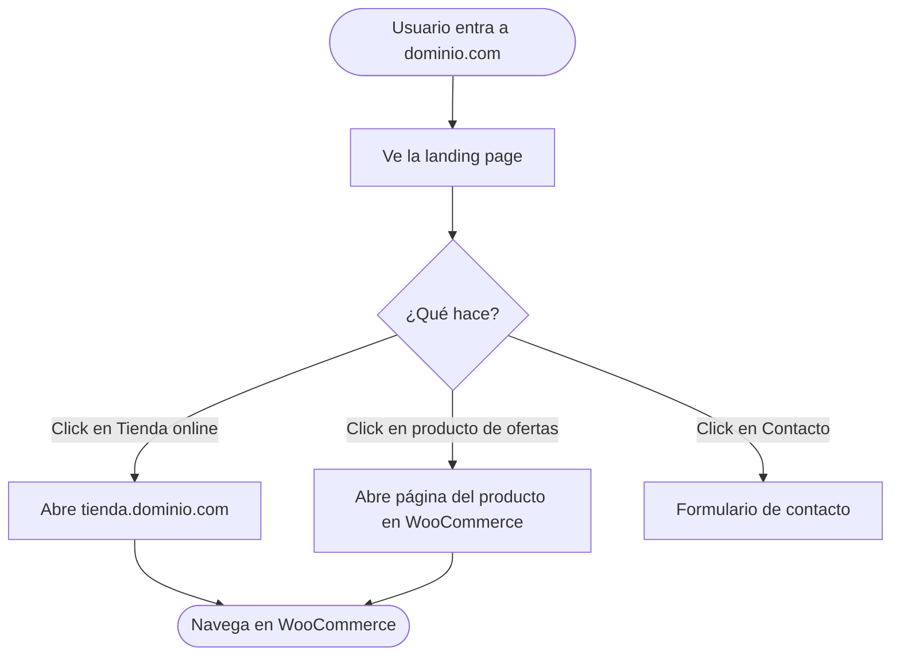
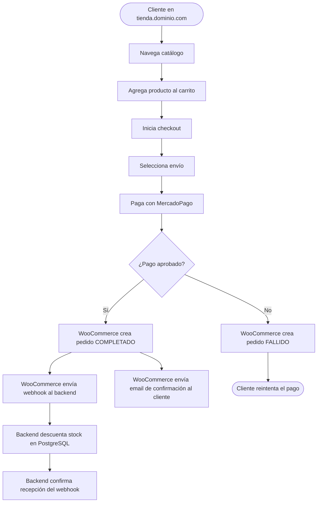
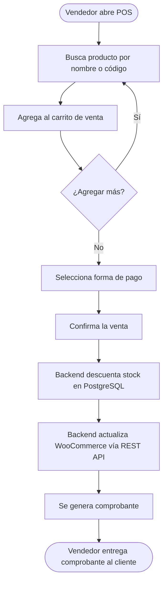
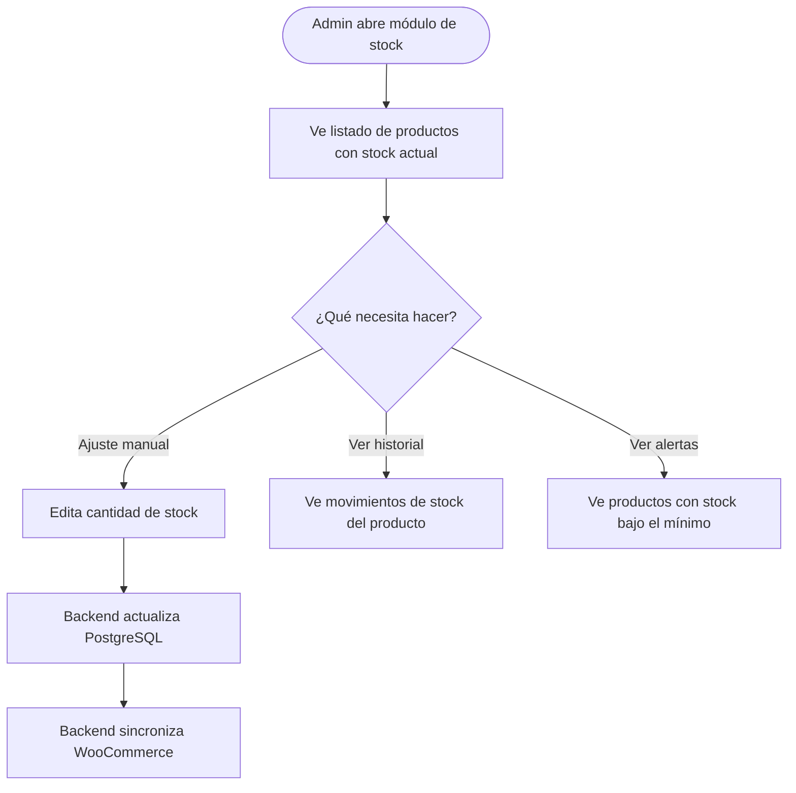
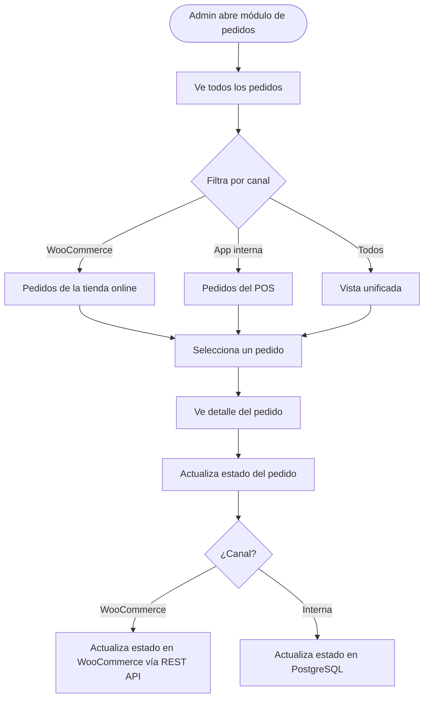
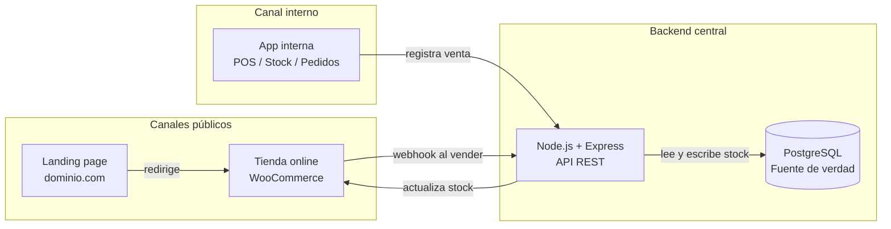

# Sistema E-Commerce — Documento técnico
### Lógica de funcionamiento, arquitectura y flujos

> **Versión:** 1.0  
> **Estado:** Borrador — completar con datos reales del proyecto  
> **Adjuntar en cada sesión:** `CONTEXT.md` + `CONTEXT-TIENDA.md` + `lib/theme.ts`

---

## 1. Visión general del sistema

El sistema está compuesto por **tres capas** que conviven de manera independiente pero comparten datos a través de un backend central y una base de datos PostgreSQL.

| Capa | Tecnología | Audiencia | Hosting |
|------|-----------|-----------|---------|
| Landing page | Next.js | Público general | Vercel (gratis) |
| App web interna | Next.js + Node.js | Vendedores / Admin | Railway |
| Tienda online | WooCommerce | Público general | DonWeb / SiteGround |

La clave del sistema es que **el stock no vive en WooCommerce** sino en una base de datos PostgreSQL propia. WooCommerce es un canal de venta más, no la fuente de verdad. Esto permite operar con múltiples canales sin inconsistencias de inventario.

---

## 2. Arquitectura general

```
                        ┌─────────────────────────────┐
                        │        CLIENTE PÚBLICO       │
                        └────────────┬────────────────┘
                                     │
                    ┌────────────────▼────────────────┐
                    │         LANDING PAGE             │
                    │   dominio.com  —  Next.js        │
                    │                                  │
                    │  • Presentación del negocio      │
                    │  • Sección de ofertas            │
                    │  • Botón "Tienda online"         │
                    └────────────────┬────────────────┘
                                     │ redirige
                    ┌────────────────▼────────────────┐
                    │        TIENDA ONLINE             │
                    │  tienda.dominio.com — WooCommerce│
                    │                                  │
                    │  • Catálogo completo             │
                    │  • Carrito y checkout            │
                    │  • MercadoPago / envíos          │
                    └────────────────┬────────────────┘
                                     │ webhook al vender
                    ┌────────────────▼────────────────┐
                    │       BACKEND + BASE DE DATOS    │
                    │   Node.js + Express + PostgreSQL │
                    │             Railway              │
                    │                                  │
                    │  • Fuente de verdad del stock    │
                    │  • Sincronización bidireccional  │
                    │  • API para app interna          │
                    └────────────────┬────────────────┘
                                     │ API privada
                    ┌────────────────▼────────────────┐
                    │       APP WEB INTERNA            │
                    │   app.dominio.com — Next.js      │
                    │                                  │
                    │  • Login de vendedores           │
                    │  • Punto de venta (POS)          │
                    │  • Gestión de stock              │
                    │  • Pedidos de todos los canales  │
                    └─────────────────────────────────┘
```

---

## 3. Capa 1 — Landing page

### ¿Qué hace?

La landing es la puerta de entrada pública al negocio. Su función principal es presentar la marca y dirigir al usuario hacia la tienda online.

### Secciones principales

- **Hero / cabecera:** imagen, slogan y llamada a la acción principal
- **Sección de ofertas:** 2 a 6 productos destacados con imagen, nombre y precio
- **Sobre nosotros / servicios**
- **Contacto**
- **Footer** con link a la tienda online y redes sociales

### Lógica de la sección de ofertas

Los productos de la sección de ofertas no son el catálogo completo. Son una selección curada para captar la atención del visitante.

**Versión inicial (hardcodeada):**  
Los productos se definen directamente en `lib/theme.ts`. Para cambiar una oferta, se edita el archivo y se redeploya. Apropiado para arrancar.

**Versión futura (dinámica):**  
Los productos se obtienen desde el backend consultando WooCommerce por productos con el tag `oferta-landing`. El cliente puede cambiar las ofertas desde el panel de WordPress sin tocar código.

### Flujo del usuario en la landing



---

## 4. Capa 2 — Tienda online (WooCommerce)

### ¿Qué hace?

WooCommerce es el canal de venta público. El cliente navega el catálogo, agrega productos al carrito y completa el pago sin salir de `tienda.dominio.com`.

### Responsabilidades de WooCommerce

- Mostrar el catálogo de productos con fotos, descripciones y precios
- Gestionar el carrito de compras
- Procesar el checkout y el pago (MercadoPago)
- Calcular y gestionar el envío (OCA, Andreani, Correo Argentino)
- Enviar emails de confirmación al comprador
- Notificar al backend vía webhook cuando se concreta una venta

### Lo que WooCommerce NO hace

- **No es la fuente de verdad del stock.** El stock en WooCommerce es un reflejo del stock real que vive en PostgreSQL.
- **No gestiona ventas internas.** Las ventas realizadas por vendedores se registran en la app interna.

### Flujo de compra en WooCommerce



### Plugins necesarios

| Plugin | Función |
|--------|---------|
| WooCommerce | Base del e-commerce |
| MercadoPago for WooCommerce | Procesador de pagos AR |
| OCA e-Pak | Cotización y tracking OCA |
| Andreani para WooCommerce | Cotización y tracking Andreani |
| WooCommerce REST API | Comunicación con el backend (nativo) |

---

## 5. Capa 3 — Backend y base de datos

### ¿Qué hace?

El backend es el núcleo del sistema. Es el único componente que tiene acceso directo a la base de datos y que habla con WooCommerce. Actúa como puente entre la app interna y la tienda online.

### Responsabilidades

- Mantener el stock actualizado en PostgreSQL (fuente de verdad)
- Recibir webhooks de WooCommerce y procesarlos
- Actualizar el stock en WooCommerce cuando se produce una venta interna
- Exponer una API privada para la app interna (CRUD de productos, pedidos, clientes)
- Autenticar a los vendedores (junto con NextAuth en el frontend)

### Sincronización de stock — lógica central

```mermaid
flowchart TD
    subgraph VENTA_WOO["Venta en WooCommerce"]
        W1([Pedido completado en WooCommerce]) --> W2[WooCommerce envía webhook]
        W2 --> W3[Backend recibe webhook]
        W3 --> W4[Valida firma del webhook]
        W4 --> W5[Descuenta stock en PostgreSQL]
        W5 --> W6[Confirma 200 OK a WooCommerce]
    end

    subgraph VENTA_INTERNA["Venta en app interna"]
        I1([Vendedor registra venta en POS]) --> I2[App interna llama API del backend]
        I2 --> I3[Backend valida stock disponible en PostgreSQL]
        I3 --> I4{¿Hay stock?}
        I4 -->|Sí| I5[Descuenta stock en PostgreSQL]
        I5 --> I6[Actualiza stock en WooCommerce vía REST API]
        I6 --> I7[Genera comprobante de venta]
        I4 -->|No| I8([Error: sin stock suficiente])
    end
```



### Modelos de datos principales

```
productos
├── id
├── nombre
├── sku
├── precio
├── stock_actual       ← fuente de verdad
├── stock_minimo       ← para alertas
├── woo_product_id     ← ID del producto en WooCommerce
└── activo

pedidos
├── id
├── canal              ← "woocommerce" | "interna"
├── estado             ← pendiente / confirmado / enviado / entregado
├── cliente_id
├── total
├── fecha
└── items[]

pedido_items
├── pedido_id
├── producto_id
├── cantidad
└── precio_unitario

usuarios_internos
├── id
├── nombre
├── email
├── rol               ← "admin" | "vendedor"
└── activo
```

---

## 6. Capa 4 — App web interna

### ¿Qué hace?

La app interna es el panel de control del negocio. Solo acceden vendedores y administradores con login. Desde acá se operan las ventas presenciales/telefónicas, se gestiona el stock y se monitorean todos los pedidos (de todos los canales).

### Módulos

#### 6.1 Punto de venta (POS)

Permite a un vendedor registrar una venta en tiempo real.



#### 6.2 Gestión de stock



#### 6.3 Pedidos unificados

Muestra en una sola pantalla todos los pedidos, sin importar de qué canal vienen.



---

## 7. Flujo completo del sistema — visión global



---

## 8. Dominios y entornos

| Entorno | URL | Tecnología | Hosting |
|---------|-----|-----------|---------|
| Landing | `dominio.com` | Next.js | Vercel |
| Tienda | `tienda.dominio.com` | WooCommerce | DonWeb/SiteGround |
| App interna | `app.dominio.com` | Next.js | Railway |
| Backend API | `api.dominio.com` | Node.js + Express | Railway |
| Base de datos | — | PostgreSQL | Railway |

---

## 9. Seguridad

- **App interna:** protegida con login (NextAuth.js). Sin sesión activa, redirige al login.
- **Backend API:** rutas privadas protegidas con JWT. Solo la app interna tiene acceso.
- **Webhooks de WooCommerce:** validados con firma HMAC-SHA256 usando `WC_WEBHOOK_SECRET`.
- **WooCommerce REST API:** Consumer Key y Secret solo en variables de entorno del backend. Nunca en el frontend.
- **HTTPS obligatorio** en todos los entornos para que los webhooks funcionen.

---

## 10. Plan de desarrollo por etapas

### Etapa 1 — Tienda online operativa

**Objetivo:** tener WooCommerce funcionando con pagos y envíos reales.

1. Contratar hosting PHP (DonWeb o SiteGround Argentina)
2. Instalar WordPress + WooCommerce
3. Activar pretty permalinks (necesario para REST API)
4. Cargar productos con fotos, precios y stock inicial
5. Instalar y configurar plugin MercadoPago (probar en sandbox)
6. Instalar plugins de envío (OCA / Andreani)
7. Conectar la landing existente con link a la tienda

**Resultado:** clientes pueden comprar en `tienda.dominio.com` con MercadoPago.

---

### Etapa 2 — Backend y sincronización de stock

**Objetivo:** conectar WooCommerce con PostgreSQL para tener stock unificado.

1. Crear proyecto Node.js + Express en Railway
2. Configurar PostgreSQL con Prisma (modelos: productos, pedidos, usuarios)
3. Habilitar WooCommerce REST API → generar Consumer Key y Secret
4. Implementar endpoint de recepción de webhooks con validación de firma
5. Implementar sincronización: webhook → PostgreSQL
6. Implementar actualización de stock en WooCommerce desde el backend
7. Testear flujo completo: venta en Woo → webhook → PostgreSQL actualizado

**Resultado:** el stock se descuenta automáticamente en PostgreSQL al vender en WooCommerce.

---

### Etapa 3 — App web interna

**Objetivo:** panel para que los vendedores operen desde adentro.

1. Crear rutas protegidas en Next.js con route groups `(dashboard)`
2. Implementar autenticación con NextAuth.js
3. Módulo de stock: listado, edición manual, historial, alertas
4. Módulo POS: búsqueda de productos, carrito, formas de pago, comprobante
5. Módulo de pedidos: vista unificada Woo + interna, cambio de estado
6. Módulo de clientes (opcional en esta etapa)

**Resultado:** los vendedores pueden registrar ventas internas y el stock se mantiene sincronizado en tiempo real.

---

### Etapa 4 — Sección de ofertas en landing

**Objetivo:** mostrar productos destacados en la landing linkeando a WooCommerce.

1. Crear componente `ofertas.tsx` en la landing
2. Versión A: definir productos en `lib/theme.ts` (hardcodeado)
3. Versión B (opcional): traer productos con tag `oferta-landing` desde la API

**Resultado:** la landing muestra ofertas y al hacer click abre el producto en WooCommerce.

---

### Backlog (etapas futuras)

- Migración a headless: Next.js renderiza el catálogo consumiendo WooCommerce REST API (Opción A)
- App móvil para vendedores (React Native / Expo)
- Reportes de ventas por canal con gráficos
- Notificaciones por email al cliente (Resend)
- Sistema de cupones y descuentos cruzados entre canales
- Dashboard de métricas para el admin (ventas diarias, stock crítico, pedidos pendientes)

---

## 11. Decisiones técnicas tomadas

| Decisión | Alternativa descartada | Motivo |
|----------|----------------------|--------|
| WooCommerce para tienda pública | Desarrollar tienda desde cero | Meses de desarrollo vs. días. Pagos y envíos ya resueltos. |
| PostgreSQL como fuente de verdad del stock | WooCommerce como fuente de verdad | Control total, independencia de WordPress, multi-canal. |
| Next.js para landing y app interna | Proyectos separados con otro stack | Mismo lenguaje (TypeScript), reutilización de componentes, deploy simple. |
| Railway para backend y BD | Heroku / AWS | Bajo costo, soporte nativo Node.js + PostgreSQL, buen DX. |
| Opción B (separada) al arrancar | Headless desde el inicio | Lanzamiento rápido. Headless se implementa cuando el volumen lo justifique. |
| Node.js + Express para backend | API routes de Next.js | El backend necesita recibir webhooks, manejar jobs de sincronización y escalar independientemente del frontend. |

---

**Última actualización:** [DD/MM/AAAA]  
**Autor:** [nombre]  
**Próxima revisión:** al completar Etapa 1
